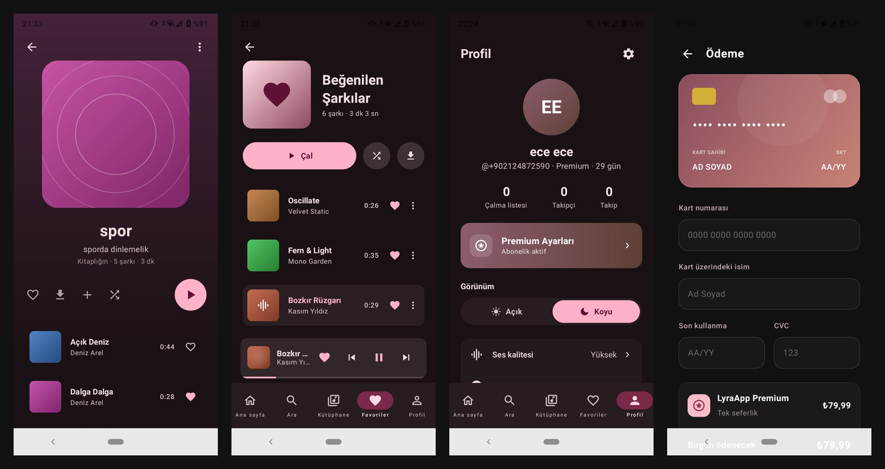

# LyraApp

LyraApp is an online and offline music player mobile application built for Android using Jetpack Compose and Kotlin. It integrates with a RESTful API to stream music, manage user profiles, handle premium subscriptions, support ad-supported playback, and sync user preferences such as favorite tracks.

---

## Technology Stack

The project leverages modern Android development libraries and tools:

- **Programming Language**: Kotlin
- **UI Framework**: Jetpack Compose (via Compose Bill of Materials (BOM) & Material 3)
- **Dependency Injection**: Hilt (for modular, testable dependency management)
- **Asynchronous Execution**: Kotlin Coroutines & Flow (for reactive, non-blocking operations)
- **Networking**: Retrofit & OkHttp (for REST API communication)
- **Media Playback**: ExoPlayer (for streaming audio and managing ad-supported queues)
- **Local Storage**: DataStore Preferences (for persistent settings such as user theme) and file-based storage (for offline downloads and favorite songs cache)
- **Annotation Processing**: Kotlin Symbol Processing (KSP)

---

## Architectural Pattern: Model-View-Intent (MVI)

The presentation layer of LyraApp is built strictly around the **MVI (Model-View-Intent)** architecture pattern. This enforces a unidirectional data flow to ensure UI stability, predictability, and testability.

### Core MVI Components
- **State**: An immutable representation of the UI state, emitted via a `StateFlow`.
- **Intent**: Actions initiated by the user or the system (e.g., clicking a button, reloading a feed) that are dispatched to the ViewModel.
- **Effect**: One-time, transient events (such as navigating to another screen or showing a snackbar) that are processed exactly once.

### Unidirectional Data Flow
1. The **UI (Screen)** captures user actions and emits an **Intent**.
2. The **ViewModel** receives the Intent, coordinates with the data/repository layer, updates the **State**, or emits an **Effect** for navigation/alerts.
3. The **UI (Route)** observes the state changes and re-renders the stateless screen components, while launching side-effects for incoming Effects.


## Implemented Features

LyraApp includes several features designed for a seamless music-listening experience:

- **Passwordless Authentication**: Secure registration and OTP login via SMS verification. Authenticated sessions use JWT tokens stored securely.
- **Personalized Home Feed**: Dynamic sections including user recommendations, recently played tracks, and custom "For You" playlists.
- **Playback History Tracking**: Plays are automatically recorded on the server as soon as playback starts to generate recommendations.
- **Ad-Supported Playback for Free Users**: ExoPlayer playback integrates advertisements for non-premium accounts, utilizing server-guided playback queues and completion updates.
- **Premium Plan & Checkout**: Paywall interface containing subscription options and checkout flow integration.
- **Synchronized Favorites System**: Synchronized favorite (like) status across all player and list views using a locally cached repository configuration.
- **Offline Song Downloads**: Downloading tracks for offline listening, displaying native system notifications when downloads are completed.
- **User-Friendly Error Translation**: Custom network exception handler mapping raw HTTP codes (such as HTTP 401) and exceptions to readable, user-friendly Turkish messages.

---

## Project Structure

The codebase is organized into features and layers as follows:

```text
com.turkcell.lyraapp/
│
├── data/                       # Data layer (repositories, local databases, network API sources)
│   ├── auth/                   # Authentication repositories and mock implementations
│   ├── favorites/              # Local favorites cache management
│   ├── home/                   # Repositories for recommendations and play history
│   ├── player/                 # Media playback and download repositories
│   ├── profile/                # Profile and membership repository management
│   └── network/                # API client configuration and endpoints
│
├── di/                         # Hilt dependency injection modules
│
└── ui/                         # Presentation layer
    ├── auth/                   # Login, registration, and OTP screens
    ├── checkout/               # Premium subscription payment screen
    ├── favorites/              # List of Liked Songs
    ├── home/                   # Home Dashboard
    ├── navigation/             # App navigation routing graphs
    ├── player/                 # Full screen and mini playback controller
    ├── premium/                # Paywall subscription selector screen
    ├── profile/                # User profile dashboard
    ├── theme/                  # Design tokens, color system, and Material 3 theme setups
    └── components/             # Reusable UI widgets
```


## Getting Started

### Prerequisites
- Android Studio Ladybug/Meerkat or later
- JDK 17 or higher
- Android SDK 34 (API level 34)

<!--
### Configuration
During local build processes using Kotlin Symbol Processing (KSP) alongside AGP 9, you might need to append the following property to your `gradle.properties` file:

```properties
android.disallowKotlinSourceSets=false
-->
### Running the App
1. Open the project folder in Android Studio.
2. Synchronize the project with Gradle files.
3. Select an Emulator or physical Android device.
4. Click **Run** to compile and launch the application.

